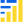

<p align="center">
  
</p>

<div class="title-block" style="text-align: center;" align="center">

[](https://x.com/composertrade)
[](https://pypi.org/project/composer-trade-py)
[](https://www.reddit.com/r/ComposerTrade)

<p align="center">
  <strong>Programmatic Strategy Python SDK</strong>
</p>
<p align="center">
  An Unoffical Python SDK for the <a href="https://www.composer.trade">Composer</a> trading platform API. Build, backtest, and deploy automated trading strategies (called "symphonies") programmatically.
</p>

</div>

## Features

- **Complete API Coverage**: All endpoints from the Composer API
- **Type-Safe Models**: Full Pydantic models for all requests and responses
- **Programmatic Symphony Building**: Build trading strategies using Python code
- **Backtesting**: Test strategies before deploying
- **Portfolio Management**: View holdings, stats, and history
- **Direct Trading**: Place orders directly
- **Market Data**: Access options chains and contract data

## Installation

```bash
pip install composer-trade-py
```

## Quick Start
## Building a Symphony

Create automated trading strategies programmatically:

```python
from composer.models.common.symphony import Asset, WeightCashEqual
from dotenv import load_dotenv

load_dotenv()

# Initialize client
client = ComposerClient(
    api_key=os.getenv("COMPOSER_API_KEY"),
    api_secret=os.getenv("COMPOSER_API_SECRET"),
)

# Build a simple strategy
symphony = SymphonyDefinition(
    name="Buy and Hold AAPL",
    description="Simple buy and hold strategy",
    rebalance="daily",
    children=[
        WeightCashEqual(
            children=[Asset(ticker="AAPL", name="Apple Inc")]
        )
    ]
)

# Create it in your account
result = client.user_symphony.create_symphony(
    name="Buy and Hold AAPL",
    color="#FF6B6B",
    hashtag="#AAPL",
    symphony=symphony
)
print(f"Created symphony: {result.symphony_id}")
```

## Backtesting

Test your strategies before deploying:

```python
from composer.models.backtest import BacktestParams
from composer.models.common import SymphonyDefinition

# Run a backtest
result = client.user_symphony.backtest_symphony(
    symphony_id="your-symphony-id",
    params=BacktestParams(
        capital=10000.0,
        start_date="2020-01-01",
        end_date="2024-01-01",
        benchmark_tickers=["SPY"]
    )
)

print(f"Sharpe Ratio: {result.stats.sharpe_ratio}")
print(f"Cumulative Return: {result.stats.cumulative_return}")
```

Or run a backtest with a custom symphony definition:

```python
from composer.models.backtest import BacktestParams
from composer.models.common import SymphonyDefinition

result = client.backtest.run(
    BacktestParams(
        capital=10000.0,
        start_date="2020-01-01",
        end_date="2024-01-01",
        benchmark_tickers=["SPY"],
        symphony=symphony
    )
)

print(f"Sharpe Ratio: {result.stats.sharpe_ratio}")
print(f"Cumulative Return: {result.stats.cumulative_return}")
```


## Common Building Blocks
You can also checkout the [composer-trade-common](https://github.com/SolarWolf-Code/composer-trade-common) package for how to import and use commonly used blocks in your symphonies.


## Documentation
For SDK Documentation:, visit the the docs here:  
 - [SDK Docs](https://solarwolf-code.github.io/composer-trade-py/)


For direct API documentation, visit the various Composer API Docs:

- [Trading API](https://trading-api.composer.trade/api/v1/api-docs/index.html#/)
- [Backtest API](https://backtest-api.composer.trade/api/v1/api-docs/index.html#/)
- [Stagehand API](https://stagehand-api.composer.trade/api/v1/api-docs/index.html)
